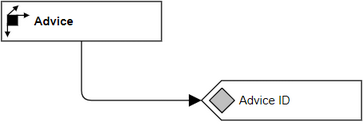

# Overview for Diagram **DimAdvice**:

## recognized shapes from b.telligent ADAPT library:

|Shape ID|Shape Type|Label|
|--------|----------|-----|
|DimAdvice.0bGNPsY97k1aB0GLz53n-1|Dimension|Advice|
|DimAdvice.0bGNPsY97k1aB0GLz53n-7|Attribute|Advice ID|

## recognized connections from b.telligent ADAPT library:

|Source Type|Source Label|Connection Type|Label|Target Type|Target Label|Connection ID|Source ID|Target ID|
|-----------|------------|---------------|-----|-----------|------------|-------------|---------|---------|
|Dimension|Advice|LoosePrecedence||Attribute|Advice ID|DimAdvice.0bGNPsY97k1aB0GLz53n-10|DimAdvice.0bGNPsY97k1aB0GLz53n-1|DimAdvice.0bGNPsY97k1aB0GLz53n-7
