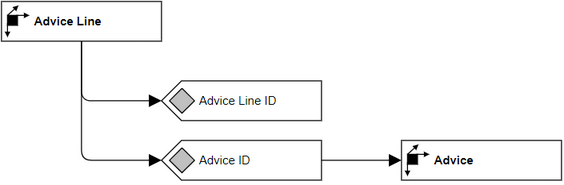

# Overview for Diagram **DimAdviceLine**:

## recognized shapes from b.telligent ADAPT library:

|Shape ID|Shape Type|Label|
|--------|----------|-----|
|DimAdviceLine.VVB_PqHr9NoXP4snUmqs-1|Dimension|Advice Line|
|DimAdviceLine.VVB_PqHr9NoXP4snUmqs-7|Attribute|Advice Line ID|
|DimAdviceLine.VVB_PqHr9NoXP4snUmqs-10|Attribute|Advice ID|
|DimAdviceLine.VVB_PqHr9NoXP4snUmqs-15|Dimension|Advice|

## recognized connections from b.telligent ADAPT library:

|Source Type|Source Label|Connection Type|Label|Target Type|Target Label|Connection ID|Source ID|Target ID|
|-----------|------------|---------------|-----|-----------|------------|-------------|---------|---------|
|Dimension|Advice Line|LoosePrecedence||Attribute|Advice Line ID|DimAdviceLine.VVB_PqHr9NoXP4snUmqs-13|DimAdviceLine.VVB_PqHr9NoXP4snUmqs-1|DimAdviceLine.VVB_PqHr9NoXP4snUmqs-7
|Dimension|Advice Line|LoosePrecedence||Attribute|Advice ID|DimAdviceLine.VVB_PqHr9NoXP4snUmqs-14|DimAdviceLine.VVB_PqHr9NoXP4snUmqs-1|DimAdviceLine.VVB_PqHr9NoXP4snUmqs-10
|Attribute|Advice ID|LoosePrecedence||Dimension|Advice|DimAdviceLine.VVB_PqHr9NoXP4snUmqs-21|DimAdviceLine.VVB_PqHr9NoXP4snUmqs-10|DimAdviceLine.VVB_PqHr9NoXP4snUmqs-15
