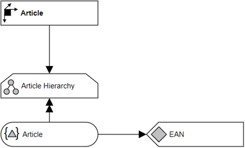

# Overview for Diagram **DimArticle**:

## recognized shapes from b.telligent ADAPT library:

|Shape ID|Shape Type|Label|
|--------|----------|-----|
|DimArticle.3ULKT6b0YpKw7mlDAFzM-1|Dimension|Article|
|DimArticle.3ULKT6b0YpKw7mlDAFzM-13|Hierarchy|Article Hierarchy|
|DimArticle.3ULKT6b0YpKw7mlDAFzM-21|HierarchyLevel|Article|
|DimArticle.3ULKT6b0YpKw7mlDAFzM-28|Attribute|EAN|

## recognized connections from b.telligent ADAPT library:

|Source Type|Source Label|Connection Type|Label|Target Type|Target Label|Connection ID|Source ID|Target ID|
|-----------|------------|---------------|-----|-----------|------------|-------------|---------|---------|
|Dimension|Article|LoosePrecedence||Hierarchy|Article Hierarchy|DimArticle.3ULKT6b0YpKw7mlDAFzM-26|DimArticle.3ULKT6b0YpKw7mlDAFzM-1|DimArticle.3ULKT6b0YpKw7mlDAFzM-13
|Hierarchy|Article Hierarchy|StrictPrecedence||HierarchyLevel|Article|DimArticle.3ULKT6b0YpKw7mlDAFzM-27|DimArticle.3ULKT6b0YpKw7mlDAFzM-13|DimArticle.3ULKT6b0YpKw7mlDAFzM-21
|HierarchyLevel|Article|LoosePrecedence||Attribute|EAN|DimArticle.3ULKT6b0YpKw7mlDAFzM-31|DimArticle.3ULKT6b0YpKw7mlDAFzM-21|DimArticle.3ULKT6b0YpKw7mlDAFzM-28
