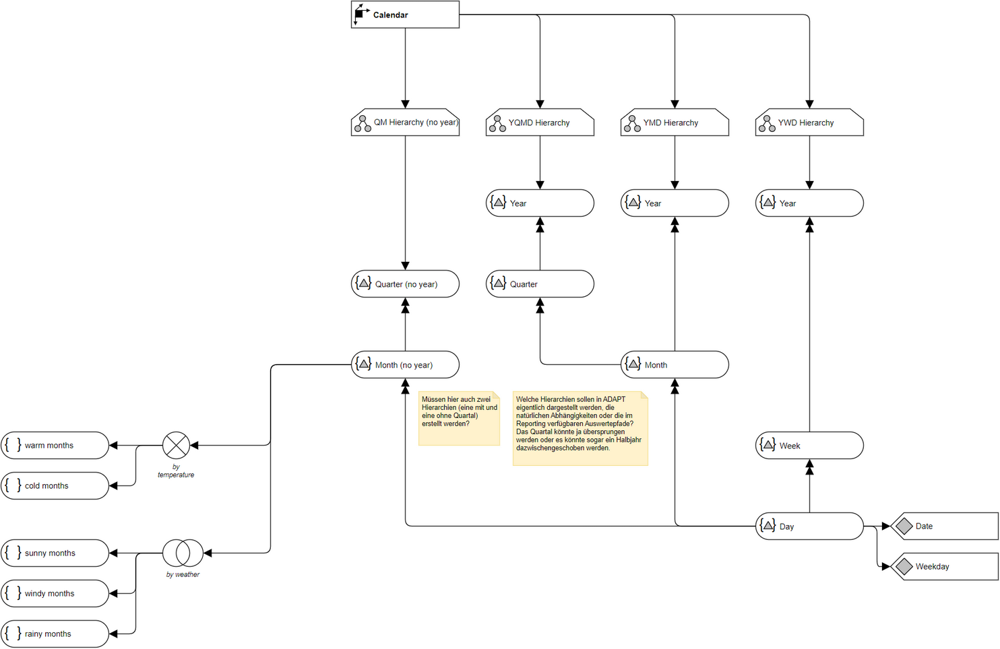

# Overview for Diagram **DimCalendar**:

## recognized shapes from b.telligent ADAPT library:

|Shape ID|Shape Type|Label|
|--------|----------|-----|
|DimCalendar.f77LYvtL0lH_vqSuSwCJ-1|Dimension|Calendar|
|DimCalendar.f77LYvtL0lH_vqSuSwCJ-7|Hierarchy|QM Hierarchy (no year)|
|DimCalendar.f77LYvtL0lH_vqSuSwCJ-15|Hierarchy|YQMD Hierarchy|
|DimCalendar.f77LYvtL0lH_vqSuSwCJ-23|Hierarchy|YMD Hierarchy|
|DimCalendar.f77LYvtL0lH_vqSuSwCJ-31|Hierarchy|YWD Hierarchy|
|DimCalendar.vdX0nlRlNV5u23rPeZXY-55|HierarchyLevel|Quarter (no year)|
|DimCalendar.vdX0nlRlNV5u23rPeZXY-61|HierarchyLevel|Month (no year)|
|DimCalendar.vdX0nlRlNV5u23rPeZXY-67|HierarchyLevel|Year|
|DimCalendar.vdX0nlRlNV5u23rPeZXY-73|HierarchyLevel|Quarter|
|DimCalendar.vdX0nlRlNV5u23rPeZXY-79|HierarchyLevel|Year|
|DimCalendar.vdX0nlRlNV5u23rPeZXY-85|HierarchyLevel|Year|
|DimCalendar.vdX0nlRlNV5u23rPeZXY-96|HierarchyLevel|Month|
|DimCalendar.vdX0nlRlNV5u23rPeZXY-103|HierarchyLevel|Week|
|DimCalendar.vdX0nlRlNV5u23rPeZXY-109|HierarchyLevel|Day|
|DimCalendar.vdX0nlRlNV5u23rPeZXY-117|Comment|Müssen hier auch zwei Hierarchien (eine mit und eine ohne Quartal) erstellt werden?|
|DimCalendar.vdX0nlRlNV5u23rPeZXY-118|Comment|Welche Hierarchien sollen in ADAPT eigentlich dargestellt werden, die natürlichen Abhängigkeiten oder die im Reporting verfügbaren Auswertepfade? Das Quartal könnte ja übersprungen werden oder es könnte sogar ein Halbjahr dazwischengeschoben werden.|
|DimCalendar.vdX0nlRlNV5u23rPeZXY-146|Attribute|Date|
|DimCalendar.vdX0nlRlNV5u23rPeZXY-150|Attribute|Weekday|
|DimCalendar.vdX0nlRlNV5u23rPeZXY-186|MeasureDimension|Measures|
|DimCalendar.vdX0nlRlNV5u23rPeZXY-187|MeasureGroup|Advice Line|
|DimCalendar.vdX0nlRlNV5u23rPeZXY-201|DimensionMember|Bruttoumsatz|
|DimCalendar.vdX0nlRlNV5u23rPeZXY-222|Function|
(Nettoumsatz *&nbsp;

Umsatzsteuer / 100)

+ Ausgleichsfaktor
|
|DimCalendar.vdX0nlRlNV5u23rPeZXY-296|DimensionMember|Nettoumsatz|
|DimCalendar.vdX0nlRlNV5u23rPeZXY-302|Function|&lt;Function&gt;|
|DimCalendar.vdX0nlRlNV5u23rPeZXY-309|DimensionScope|Dimension Scope|
|DimCalendar.vdX0nlRlNV5u23rPeZXY-312|FullyOverlapping|Fully Overlapping
|
|DimCalendar.vdX0nlRlNV5u23rPeZXY-315|FullyExclusive|Fully Exclusive|

## recognized connections from b.telligent ADAPT library:

|Source Type|Source Label|Connection Type|Label|Target Type|Target Label|Connection ID|Source ID|Target ID|
|-----------|------------|---------------|-----|-----------|------------|-------------|---------|---------|
|Dimension|Calendar|LoosePrecedence||Hierarchy|QM Hierarchy (no year)|DimCalendar.f77LYvtL0lH_vqSuSwCJ-39|DimCalendar.f77LYvtL0lH_vqSuSwCJ-1|DimCalendar.f77LYvtL0lH_vqSuSwCJ-7
|HierarchyLevel|Quarter (no year)|StrictPrecedence||HierarchyLevel|Month (no year)|DimCalendar.vdX0nlRlNV5u23rPeZXY-66|DimCalendar.vdX0nlRlNV5u23rPeZXY-55|DimCalendar.vdX0nlRlNV5u23rPeZXY-61
|HierarchyLevel|Year|StrictPrecedence||HierarchyLevel|Quarter|DimCalendar.vdX0nlRlNV5u23rPeZXY-78|DimCalendar.vdX0nlRlNV5u23rPeZXY-67|DimCalendar.vdX0nlRlNV5u23rPeZXY-73
|Hierarchy|QM Hierarchy (no year)|LoosePrecedence||HierarchyLevel|Quarter (no year)|DimCalendar.vdX0nlRlNV5u23rPeZXY-91|DimCalendar.f77LYvtL0lH_vqSuSwCJ-7|DimCalendar.vdX0nlRlNV5u23rPeZXY-55
|HierarchyLevel|Year|StrictPrecedence||HierarchyLevel|Month|DimCalendar.vdX0nlRlNV5u23rPeZXY-101|DimCalendar.vdX0nlRlNV5u23rPeZXY-79|DimCalendar.vdX0nlRlNV5u23rPeZXY-96
|HierarchyLevel|Quarter|StrictPrecedence||HierarchyLevel|Month|DimCalendar.vdX0nlRlNV5u23rPeZXY-102|DimCalendar.vdX0nlRlNV5u23rPeZXY-73|DimCalendar.vdX0nlRlNV5u23rPeZXY-96
|HierarchyLevel|Year|StrictPrecedence||HierarchyLevel|Week|DimCalendar.vdX0nlRlNV5u23rPeZXY-108|DimCalendar.vdX0nlRlNV5u23rPeZXY-85|DimCalendar.vdX0nlRlNV5u23rPeZXY-103
|HierarchyLevel|Week|StrictPrecedence||HierarchyLevel|Day|DimCalendar.vdX0nlRlNV5u23rPeZXY-114|DimCalendar.vdX0nlRlNV5u23rPeZXY-103|DimCalendar.vdX0nlRlNV5u23rPeZXY-109
|HierarchyLevel|Month|StrictPrecedence||HierarchyLevel|Day|DimCalendar.vdX0nlRlNV5u23rPeZXY-115|DimCalendar.vdX0nlRlNV5u23rPeZXY-96|DimCalendar.vdX0nlRlNV5u23rPeZXY-109
|HierarchyLevel|Month (no year)|StrictPrecedence||HierarchyLevel|Day|DimCalendar.vdX0nlRlNV5u23rPeZXY-116|DimCalendar.vdX0nlRlNV5u23rPeZXY-61|DimCalendar.vdX0nlRlNV5u23rPeZXY-109
|HierarchyLevel|Day|LoosePrecedence||Attribute|Date|DimCalendar.vdX0nlRlNV5u23rPeZXY-149|DimCalendar.vdX0nlRlNV5u23rPeZXY-109|DimCalendar.vdX0nlRlNV5u23rPeZXY-146
|HierarchyLevel|Day|LoosePrecedence||Attribute|Weekday|DimCalendar.vdX0nlRlNV5u23rPeZXY-153|DimCalendar.vdX0nlRlNV5u23rPeZXY-109|DimCalendar.vdX0nlRlNV5u23rPeZXY-150
|MeasureGroup|Advice Line|LoosePrecedence|Transaction|Dimension|Calendar|DimCalendar.vdX0nlRlNV5u23rPeZXY-171|DimCalendar.vdX0nlRlNV5u23rPeZXY-187|DimCalendar.f77LYvtL0lH_vqSuSwCJ-1
|MeasureGroup|Advice Line|LoosePrecedence||MeasureDimension|Measures|DimCalendar.vdX0nlRlNV5u23rPeZXY-195|DimCalendar.vdX0nlRlNV5u23rPeZXY-187|DimCalendar.vdX0nlRlNV5u23rPeZXY-186
|MeasureDimension|Measures|LoosePrecedence||DimensionMember|Bruttoumsatz|DimCalendar.vdX0nlRlNV5u23rPeZXY-202|DimCalendar.vdX0nlRlNV5u23rPeZXY-186|DimCalendar.vdX0nlRlNV5u23rPeZXY-201
|DimensionMember|Bruttoumsatz|LoosePrecedence||Function|
(Nettoumsatz *&nbsp;

Umsatzsteuer / 100)

+ Ausgleichsfaktor
|DimCalendar.vdX0nlRlNV5u23rPeZXY-231|DimCalendar.vdX0nlRlNV5u23rPeZXY-201|DimCalendar.vdX0nlRlNV5u23rPeZXY-222
|MeasureDimension|Measures|LoosePrecedence||DimensionMember|Nettoumsatz|DimCalendar.vdX0nlRlNV5u23rPeZXY-301|DimCalendar.vdX0nlRlNV5u23rPeZXY-186|DimCalendar.vdX0nlRlNV5u23rPeZXY-296
