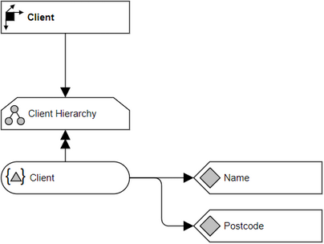

# Overview for Diagram **DimClient**:

## recognized shapes from b.telligent ADAPT library:

|Shape ID|Shape Type|Label|
|--------|----------|-----|
|DimClient.Q3E0rVoIe7EGEsI8NTwv-1|Dimension|Client|
|DimClient.Q3E0rVoIe7EGEsI8NTwv-7|Hierarchy|Client Hierarchy|
|DimClient.Q3E0rVoIe7EGEsI8NTwv-15|HierarchyLevel|Client|
|DimClient.Q3E0rVoIe7EGEsI8NTwv-20|Attribute|Postcode|
|DimClient.Q3E0rVoIe7EGEsI8NTwv-23|Attribute|Name|

## recognized connections from b.telligent ADAPT library:

|Source Type|Source Label|Connection Type|Label|Target Type|Target Label|Connection ID|Source ID|Target ID|
|-----------|------------|---------------|-----|-----------|------------|-------------|---------|---------|
|Dimension|Client|LoosePrecedence||Hierarchy|Client Hierarchy|DimClient.Q3E0rVoIe7EGEsI8NTwv-26|DimClient.Q3E0rVoIe7EGEsI8NTwv-1|DimClient.Q3E0rVoIe7EGEsI8NTwv-7
|Hierarchy|Client Hierarchy|StrictPrecedence||HierarchyLevel|Client|DimClient.Q3E0rVoIe7EGEsI8NTwv-27|DimClient.Q3E0rVoIe7EGEsI8NTwv-7|DimClient.Q3E0rVoIe7EGEsI8NTwv-15
|HierarchyLevel|Client|LoosePrecedence||Attribute|Name|DimClient.Q3E0rVoIe7EGEsI8NTwv-31|DimClient.Q3E0rVoIe7EGEsI8NTwv-15|DimClient.Q3E0rVoIe7EGEsI8NTwv-23
|HierarchyLevel|Client|LoosePrecedence||Attribute|Postcode|DimClient.Q3E0rVoIe7EGEsI8NTwv-32|DimClient.Q3E0rVoIe7EGEsI8NTwv-15|DimClient.Q3E0rVoIe7EGEsI8NTwv-20
