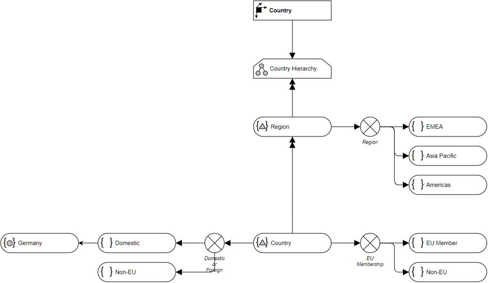

# Overview for Diagram **DimCountry**:

## recognized shapes from b.telligent ADAPT library:

|Shape ID|Shape Type|Label|
|--------|----------|-----|
|DimCountry._IXQpRyezbz_NSWvRTIf-1|Dimension|Country|
|DimCountry._IXQpRyezbz_NSWvRTIf-13|Hierarchy|Country Hierarchy|
|DimCountry._IXQpRyezbz_NSWvRTIf-21|HierarchyLevel|Region|
|DimCountry._IXQpRyezbz_NSWvRTIf-26|HierarchyLevel|Country|
|DimCountry._IXQpRyezbz_NSWvRTIf-34|FullyExclusive|Region|
|DimCountry._IXQpRyezbz_NSWvRTIf-37|DimensionScope|EMEA|
|DimCountry._IXQpRyezbz_NSWvRTIf-42|DimensionScope|Asia Pacific|
|DimCountry._IXQpRyezbz_NSWvRTIf-45|DimensionScope|Americas|
|DimCountry._IXQpRyezbz_NSWvRTIf-50|FullyExclusive|EU Membership|
|DimCountry._IXQpRyezbz_NSWvRTIf-53|DimensionScope|EU Member|
|DimCountry._IXQpRyezbz_NSWvRTIf-58|DimensionScope|Non-EU|
|DimCountry._IXQpRyezbz_NSWvRTIf-62|FullyExclusive|Domestic or Foreign|
|DimCountry._IXQpRyezbz_NSWvRTIf-65|DimensionScope|Domestic|
|DimCountry._IXQpRyezbz_NSWvRTIf-70|DimensionScope|Non-EU|
|DimCountry._IXQpRyezbz_NSWvRTIf-74|DimensionMember|Germany|

## recognized connections from b.telligent ADAPT library:

|Source Type|Source Label|Connection Type|Label|Target Type|Target Label|Connection ID|Source ID|Target ID|
|-----------|------------|---------------|-----|-----------|------------|-------------|---------|---------|
|Dimension|Country|LoosePrecedence||Hierarchy|Country Hierarchy|DimCountry._IXQpRyezbz_NSWvRTIf-31|DimCountry._IXQpRyezbz_NSWvRTIf-1|DimCountry._IXQpRyezbz_NSWvRTIf-13
|Hierarchy|Country Hierarchy|StrictPrecedence||HierarchyLevel|Region|DimCountry._IXQpRyezbz_NSWvRTIf-32|DimCountry._IXQpRyezbz_NSWvRTIf-13|DimCountry._IXQpRyezbz_NSWvRTIf-21
|HierarchyLevel|Region|StrictPrecedence||HierarchyLevel|Country|DimCountry._IXQpRyezbz_NSWvRTIf-33|DimCountry._IXQpRyezbz_NSWvRTIf-21|DimCountry._IXQpRyezbz_NSWvRTIf-26
