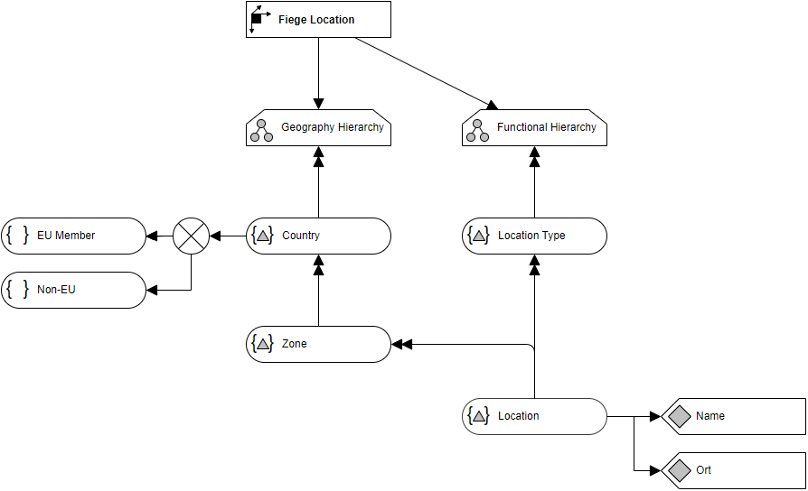

# Overview for Diagram **DimLocation**:

## recognized shapes from b.telligent ADAPT library:

|Shape ID|Shape Type|Label|
|--------|----------|-----|
|DimLocation.pI8diWF3I-Tx-rrlMoEu-1|Dimension|Location|
|DimLocation.pI8diWF3I-Tx-rrlMoEu-7|Hierarchy|Functional Hierarchy|
|DimLocation.pI8diWF3I-Tx-rrlMoEu-15|Hierarchy|Geographical Hierarchy|
|DimLocation.pI8diWF3I-Tx-rrlMoEu-23|HierarchyLevel|Location|
|DimLocation.pI8diWF3I-Tx-rrlMoEu-28|HierarchyLevel|Location Type|
|DimLocation.pI8diWF3I-Tx-rrlMoEu-33|Attribute|Name|
|DimLocation.pI8diWF3I-Tx-rrlMoEu-36|Attribute|Address|
|DimLocation.pI8diWF3I-Tx-rrlMoEu-39|Attribute|Country|
|DimLocation.pI8diWF3I-Tx-rrlMoEu-42|HierarchyLevel|Country|
|DimLocation.pI8diWF3I-Tx-rrlMoEu-47|HierarchyLevel|Zone|
|DimLocation.pI8diWF3I-Tx-rrlMoEu-52|Comment|Location always means a "Fiege Location"|
|DimLocation.pI8diWF3I-Tx-rrlMoEu-63|Dimension|Location|

## recognized connections from b.telligent ADAPT library:

|Source Type|Source Label|Connection Type|Label|Target Type|Target Label|Connection ID|Source ID|Target ID|
|-----------|------------|---------------|-----|-----------|------------|-------------|---------|---------|
|HierarchyLevel|Country|LoosePrecedence||Attribute|Country|DimLocation.pI8diWF3I-Tx-rrlMoEu-53|DimLocation.pI8diWF3I-Tx-rrlMoEu-42|DimLocation.pI8diWF3I-Tx-rrlMoEu-39
|HierarchyLevel|Location|LoosePrecedence||Attribute|Name|DimLocation.pI8diWF3I-Tx-rrlMoEu-54|DimLocation.pI8diWF3I-Tx-rrlMoEu-23|DimLocation.pI8diWF3I-Tx-rrlMoEu-33
|HierarchyLevel|Location|LoosePrecedence||Attribute|Address|DimLocation.pI8diWF3I-Tx-rrlMoEu-55|DimLocation.pI8diWF3I-Tx-rrlMoEu-23|DimLocation.pI8diWF3I-Tx-rrlMoEu-36
|HierarchyLevel|Zone|StrictPrecedence||HierarchyLevel|Location|DimLocation.pI8diWF3I-Tx-rrlMoEu-56|DimLocation.pI8diWF3I-Tx-rrlMoEu-47|DimLocation.pI8diWF3I-Tx-rrlMoEu-23
|HierarchyLevel|Location Type|StrictPrecedence||HierarchyLevel|Location|DimLocation.pI8diWF3I-Tx-rrlMoEu-57|DimLocation.pI8diWF3I-Tx-rrlMoEu-28|DimLocation.pI8diWF3I-Tx-rrlMoEu-23
|Hierarchy|Functional Hierarchy|StrictPrecedence||HierarchyLevel|Location Type|DimLocation.pI8diWF3I-Tx-rrlMoEu-58|DimLocation.pI8diWF3I-Tx-rrlMoEu-7|DimLocation.pI8diWF3I-Tx-rrlMoEu-28
|Hierarchy|Geographical Hierarchy|StrictPrecedence||HierarchyLevel|Country|DimLocation.pI8diWF3I-Tx-rrlMoEu-59|DimLocation.pI8diWF3I-Tx-rrlMoEu-15|DimLocation.pI8diWF3I-Tx-rrlMoEu-42
|HierarchyLevel|Country|StrictPrecedence||HierarchyLevel|Zone|DimLocation.pI8diWF3I-Tx-rrlMoEu-60|DimLocation.pI8diWF3I-Tx-rrlMoEu-42|DimLocation.pI8diWF3I-Tx-rrlMoEu-47
|Dimension|Location|LoosePrecedence||Hierarchy|Geographical Hierarchy|DimLocation.pI8diWF3I-Tx-rrlMoEu-61|DimLocation.pI8diWF3I-Tx-rrlMoEu-1|DimLocation.pI8diWF3I-Tx-rrlMoEu-15
|Dimension|Location|LoosePrecedence||Hierarchy|Functional Hierarchy|DimLocation.pI8diWF3I-Tx-rrlMoEu-62|DimLocation.pI8diWF3I-Tx-rrlMoEu-1|DimLocation.pI8diWF3I-Tx-rrlMoEu-7
|Attribute|Country|LoosePrecedence||Dimension|Location|DimLocation.pI8diWF3I-Tx-rrlMoEu-69|DimLocation.pI8diWF3I-Tx-rrlMoEu-39|DimLocation.pI8diWF3I-Tx-rrlMoEu-63
