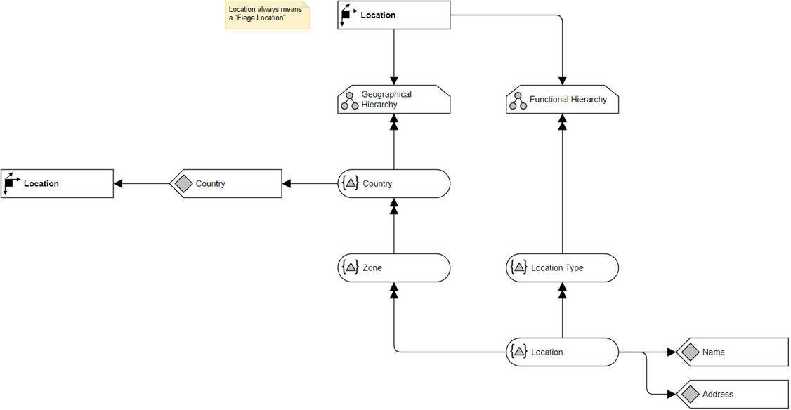

# Overview for Diagram **DimLocation**:

## recognized shapes from b.telligent ADAPT library:

|Shape ID|Shape Type|Label|
|--------|----------|-----|
|DimLocation.none|none|none|

## recognized connections from b.telligent ADAPT library:

|Source Type|Source Label|Connection Type|Label|Target Type|Target Label|Connection ID|Source ID|Target ID|
|-----------|------------|---------------|-----|-----------|------------|-------------|---------|---------|
|none|none|SelfPrecedence|none|none|none|DimLocation.none|DimLocation.none|DimLocation.none
