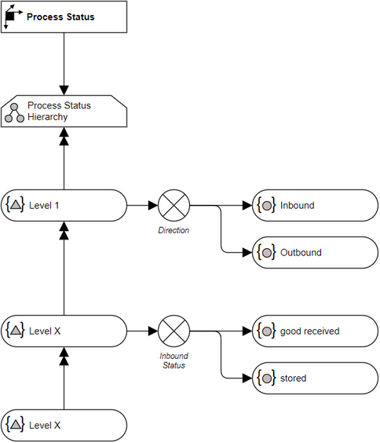

# Overview for Diagram **DimProcessStatus**:

## recognized shapes from b.telligent ADAPT library:

|Shape ID|Shape Type|Label|
|--------|----------|-----|
|DimProcessStatus.qzKK9jRwpghbmKVsXcbc-1|Dimension|Process Status|
|DimProcessStatus.qzKK9jRwpghbmKVsXcbc-7|Hierarchy|Process Status Hierarchy|
|DimProcessStatus.qzKK9jRwpghbmKVsXcbc-15|HierarchyLevel|Level 1|
|DimProcessStatus.qzKK9jRwpghbmKVsXcbc-20|HierarchyLevel|Level X|
|DimProcessStatus.qzKK9jRwpghbmKVsXcbc-33|FullyExclusive|Direction|
|DimProcessStatus.qzKK9jRwpghbmKVsXcbc-40|DimensionMember|Inbound|
|DimProcessStatus.qzKK9jRwpghbmKVsXcbc-45|DimensionMember|Outbound|
|DimProcessStatus.qzKK9jRwpghbmKVsXcbc-52|FullyExclusive|Inbound
Status
|
|DimProcessStatus.qzKK9jRwpghbmKVsXcbc-56|DimensionMember|good received|
|DimProcessStatus.qzKK9jRwpghbmKVsXcbc-61|DimensionMember|stored|
|DimProcessStatus.qzKK9jRwpghbmKVsXcbc-68|HierarchyLevel|Level X|

## recognized connections from b.telligent ADAPT library:

|Source Type|Source Label|Connection Type|Label|Target Type|Target Label|Connection ID|Source ID|Target ID|
|-----------|------------|---------------|-----|-----------|------------|-------------|---------|---------|
|Dimension|Process Status|LoosePrecedence||Hierarchy|Process Status Hierarchy|DimProcessStatus.qzKK9jRwpghbmKVsXcbc-25|DimProcessStatus.qzKK9jRwpghbmKVsXcbc-1|DimProcessStatus.qzKK9jRwpghbmKVsXcbc-7
|Hierarchy|Process Status Hierarchy|StrictPrecedence||HierarchyLevel|Level 1|DimProcessStatus.qzKK9jRwpghbmKVsXcbc-26|DimProcessStatus.qzKK9jRwpghbmKVsXcbc-7|DimProcessStatus.qzKK9jRwpghbmKVsXcbc-15
|HierarchyLevel|Level 1|StrictPrecedence||HierarchyLevel|Level X|DimProcessStatus.qzKK9jRwpghbmKVsXcbc-32|DimProcessStatus.qzKK9jRwpghbmKVsXcbc-15|DimProcessStatus.qzKK9jRwpghbmKVsXcbc-20
|HierarchyLevel|Level X|StrictPrecedence||HierarchyLevel|Level X|DimProcessStatus.qzKK9jRwpghbmKVsXcbc-73|DimProcessStatus.qzKK9jRwpghbmKVsXcbc-20|DimProcessStatus.qzKK9jRwpghbmKVsXcbc-68
