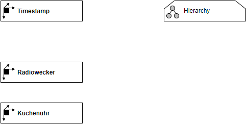

# Overview for Diagram **DimTimestamp**:

## recognized shapes from b.telligent ADAPT library:

|Shape ID|Shape Type|Label|
|--------|----------|-----|
|DimTimestamp.JcKF2ojR-ty8W29sog4p-49|Dimension|Timestamp|
|DimTimestamp.JcKF2ojR-ty8W29sog4p-40|Dimension|GGG|
|DimTimestamp.JcKF2ojR-ty8W29sog4p-71|Dimension|Kamillentee|
|DimTimestamp.JcKF2ojR-ty8W29sog4p-72|Dimension|GGG|
|DimTimestamp.JcKF2ojR-ty8W29sog4p-77|Dimension|Ostereier|
|DimTimestamp.JcKF2ojR-ty8W29sog4p-78|Dimension|GGG|

## recognized connections from b.telligent ADAPT library:

|Source Type|Source Label|Connection Type|Label|Target Type|Target Label|Connection ID|Source ID|Target ID|
|-----------|------------|---------------|-----|-----------|------------|-------------|---------|---------|
