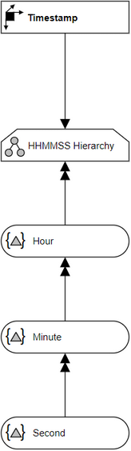

# Overview for Diagram **DimTimestamp**:

## recognized shapes from b.telligent ADAPT library:

|Shape ID|Shape Type|Label|
|--------|----------|-----|
|DimTimestamp.JcKF2ojR-ty8W29sog4p-49|Dimension|Timestamp|
|DimTimestamp.JcKF2ojR-ty8W29sog4p-89|Dimension|Radiowecker|
|DimTimestamp.JcKF2ojR-ty8W29sog4p-95|Dimension|Küchenuhr|

## recognized connections from b.telligent ADAPT library:

|Source Type|Source Label|Connection Type|Label|Target Type|Target Label|Connection ID|Source ID|Target ID|
|-----------|------------|---------------|-----|-----------|------------|-------------|---------|---------|
