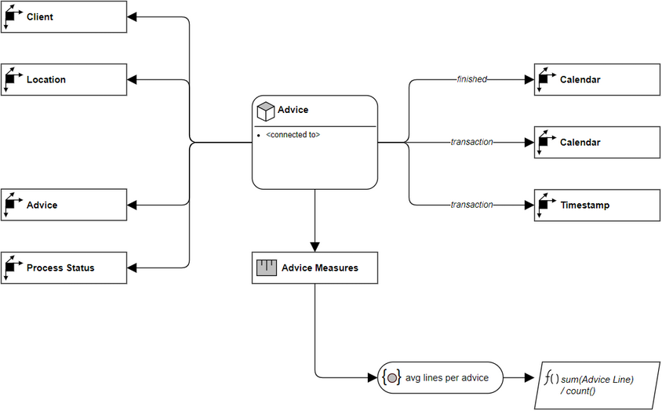

# Overview for Diagram **FactAdvice**:

## recognized shapes from b.telligent ADAPT library:

|Shape ID|Shape Type|Label|
|--------|----------|-----|
|FactAdvice.BBVSgjqUGbZZGQJtcsMZ-1|MeasureGroup|Advice|
|FactAdvice.BBVSgjqUGbZZGQJtcsMZ-8|Dimension|Client|
|FactAdvice.BBVSgjqUGbZZGQJtcsMZ-14|Dimension|Timestamp|
|FactAdvice.BBVSgjqUGbZZGQJtcsMZ-20|Dimension|Calendar|
|FactAdvice.BBVSgjqUGbZZGQJtcsMZ-26|Dimension|Calendar|
|FactAdvice.BBVSgjqUGbZZGQJtcsMZ-32|Dimension|Advice|
|FactAdvice.BBVSgjqUGbZZGQJtcsMZ-38|Dimension|Location|
|FactAdvice.BBVSgjqUGbZZGQJtcsMZ-44|Dimension|Process Status|
|FactAdvice.BBVSgjqUGbZZGQJtcsMZ-64|MeasureDimension|Advice Measures|
|FactAdvice.BBVSgjqUGbZZGQJtcsMZ-77|DimensionMember|avg lines per advice|
|FactAdvice.BBVSgjqUGbZZGQJtcsMZ-84|Function|
sum(Advice Line)&nbsp;

/ count()
|

## recognized connections from b.telligent ADAPT library:

|Source Type|Source Label|Connection Type|Label|Target Type|Target Label|Connection ID|Source ID|Target ID|
|-----------|------------|---------------|-----|-----------|------------|-------------|---------|---------|
|MeasureGroup|Advice|LoosePrecedence||Dimension|Client|FactAdvice.BBVSgjqUGbZZGQJtcsMZ-56|FactAdvice.BBVSgjqUGbZZGQJtcsMZ-1|FactAdvice.BBVSgjqUGbZZGQJtcsMZ-8
|MeasureGroup|Advice|LoosePrecedence||Dimension|Location|FactAdvice.BBVSgjqUGbZZGQJtcsMZ-57|FactAdvice.BBVSgjqUGbZZGQJtcsMZ-1|FactAdvice.BBVSgjqUGbZZGQJtcsMZ-38
|MeasureGroup|Advice|LoosePrecedence||Dimension|Advice|FactAdvice.BBVSgjqUGbZZGQJtcsMZ-59|FactAdvice.BBVSgjqUGbZZGQJtcsMZ-1|FactAdvice.BBVSgjqUGbZZGQJtcsMZ-32
|MeasureGroup|Advice|LoosePrecedence||Dimension|Process Status|FactAdvice.BBVSgjqUGbZZGQJtcsMZ-60|FactAdvice.BBVSgjqUGbZZGQJtcsMZ-1|FactAdvice.BBVSgjqUGbZZGQJtcsMZ-44
|MeasureGroup|Advice|LoosePrecedence|transaction|Dimension|Calendar|FactAdvice.BBVSgjqUGbZZGQJtcsMZ-61|FactAdvice.BBVSgjqUGbZZGQJtcsMZ-1|FactAdvice.BBVSgjqUGbZZGQJtcsMZ-26
|MeasureGroup|Advice|LoosePrecedence|transaction|Dimension|Timestamp|FactAdvice.BBVSgjqUGbZZGQJtcsMZ-62|FactAdvice.BBVSgjqUGbZZGQJtcsMZ-1|FactAdvice.BBVSgjqUGbZZGQJtcsMZ-14
|MeasureGroup|Advice|LoosePrecedence|finished|Dimension|Calendar|FactAdvice.BBVSgjqUGbZZGQJtcsMZ-63|FactAdvice.BBVSgjqUGbZZGQJtcsMZ-1|FactAdvice.BBVSgjqUGbZZGQJtcsMZ-20
|MeasureGroup|Advice|LoosePrecedence||MeasureDimension|Advice Measures|FactAdvice.BBVSgjqUGbZZGQJtcsMZ-71|FactAdvice.BBVSgjqUGbZZGQJtcsMZ-1|FactAdvice.BBVSgjqUGbZZGQJtcsMZ-64
|MeasureDimension|Advice Measures|LoosePrecedence||DimensionMember|avg lines per advice|FactAdvice.BBVSgjqUGbZZGQJtcsMZ-83|FactAdvice.BBVSgjqUGbZZGQJtcsMZ-64|FactAdvice.BBVSgjqUGbZZGQJtcsMZ-77
|DimensionMember|avg lines per advice|LoosePrecedence||Function|
sum(Advice Line)&nbsp;

/ count()
|FactAdvice.BBVSgjqUGbZZGQJtcsMZ-91|FactAdvice.BBVSgjqUGbZZGQJtcsMZ-77|FactAdvice.BBVSgjqUGbZZGQJtcsMZ-84
